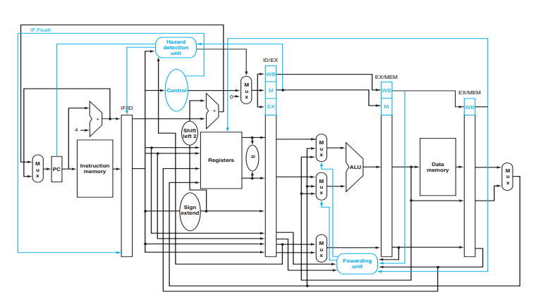

# Pipeline MIPS Processor

## Overview
A pipelined MIPS processor enhances performance by overlapping the execution of multiple instructions. It divides the instruction execution into several stages, allowing different instructions to be processed concurrently.

## MIPS Architecture
The MIPS architecture is a RISC (Reduced Instruction Set Computing) architecture characterized by its simplicity, regularity, and ease of implementation. 

## Pipeline Stages
The pipelined MIPS processor consists of the following stages:
1. **Instruction Fetch (IF):** Fetches the next instruction from memory.
2. **Instruction Decode (ID):** Decodes the instruction to determine the operation and operands.
3. **Execute (EX):** Executes the operation specified by the instruction.
4. **Memory Access (MEM):** Accesses memory for load and store instructions.
5. **Write-Back (WB):** Writes the result of the executed instruction back to the register file.

## Components
### Instruction Memory (IM)
- Stores the program instructions.
- Instructions are fetched from the instruction memory during the instruction fetch stage.

### Register File (RF)
- Stores the general-purpose registers (GPRs) used for data manipulation.
- Provides operands for arithmetic and logical operations.

### ALU (Arithmetic Logic Unit)
- Performs arithmetic and logical operations on data operands.
- Executes operations specified by the decoded instruction.

### Data Memory (DM)
- Stores data accessed by load and store instructions.
- Reads from or writes to memory based on the memory access instruction.

### Control Unit (CU)
- Generates control signals based on the decoded instruction.
- Controls the operation of various components within the processor.

### Program Counter (PC)
- Holds the address of the next instruction to be fetched.
- Updated based on the control flow of the program.

